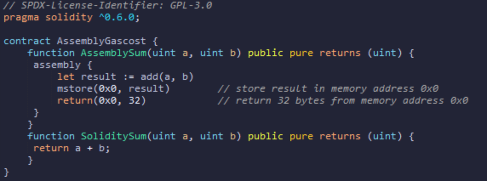
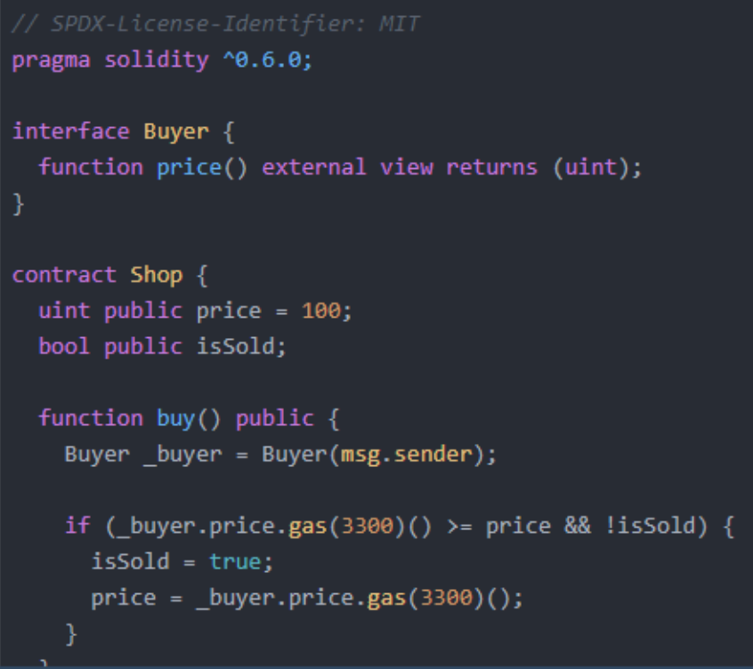
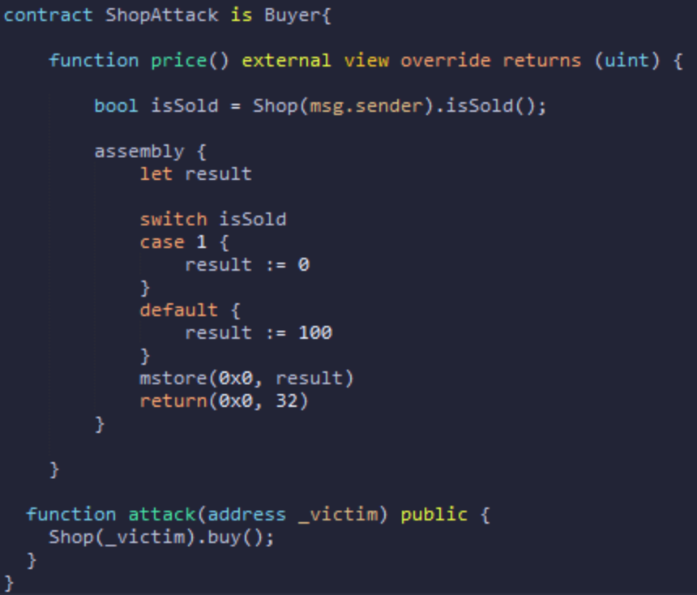

# Assembly & Low Level EVM Interaction

## Assembly in solidity

Solidity supports inline assembly in its code. Assembly gives you much more control to execute some logic that may not be possible with just Solidity. it’s useful for some goals like pointing to a memory slot and **Gas cost reduction**.

I want to compare the gas cost between Solidity and Assembly code.
As you see in the image below, we have a function with only Solidity code and using inline Assembly code that does a simple addition of two numbers and returns the result to the caller.

We save about 50-60 gas using assembly.

### Example Hack

At this level, we must buy the item for less than its price therefore we need to exploit interface Buyer.
Doing it needs to find a way to distinguish order of two calls for the price() that occur in the buy() function and then return 100 for the first call and less than 100 (like zero) for the second one.

The problem is that we have only 3300 gas available for calling price() that is less than gas needed for modify blockchain state. So we can’t use modifying storage variables in malicious contract for distinguish call orders.
but we have **isSold** variable in the Shop contract that is public and we can access it with the gas we have from the malicious contract and use it as a distinguishing point that is being changed between these two calls.

**buy()** is calling **price()** twice:

1. In **if** condition, the price returned must be 100 or higher to pass.
2. when the contract updates, that we can return a value lower than 100.

Also when I implement solidity code like: **return shop.isSold() ? 0:100;
**in the price() function, again I have gas cost problem therefore we have to implement it with inline assembly code that you can see in the image below:

 call attack function with Shop contract Instance address:

- It Calls the buy function from the Buyer contract.
- The price function reads the Shops isSold variable and returns a high price(100) when it is false, and a low price (0) when it is true.

# Key Security Takeaways

- Don’t let interface functions be unimplemented. Interfaces do not guarantee contract security. Remember that just because another contract uses the same interface, doesn’t mean it will behave as intended!
- It is unsafe to approve some action by double-calling even the same view function.
- **view** and **pure** promises might be violated without you knowing!