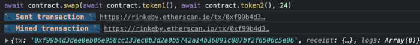
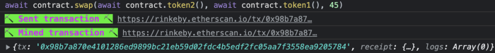

# Decentralized Exchanges

Example Vulnerable Code:

```solidity
//The goal of this is for you to hack the basic DEX contract below and steal the funds by price manipulation.

//You will start with 10 tokens of token1 and 10 of token2. The DEX contract starts with 100 of each token.

//You will be successful in this level if you manage to drain all of at least 1 of the 2 tokens from the contract, and allow the contract to report a "bad" price of the assets.

// SPDX-License-Identifier: MIT
pragma solidity ^0.6.0;

import "@openzeppelin/contracts/token/ERC20/IERC20.sol";
import "@openzeppelin/contracts/token/ERC20/ERC20.sol";
import '@openzeppelin/contracts/math/SafeMath.sol';

contract Dex  {
  using SafeMath for uint;
  address public token1;
  address public token2;
  constructor(address _token1, address _token2) public {
    token1 = _token1;
    token2 = _token2;
  }

  function swap(address from, address to, uint amount) public {
    require((from == token1 && to == token2) || (from == token2 && to == token1), "Invalid tokens");
    require(IERC20(from).balanceOf(msg.sender) >= amount, "Not enough to swap");
    uint swap_amount = get_swap_price(from, to, amount);
    IERC20(from).transferFrom(msg.sender, address(this), amount);
    IERC20(to).approve(address(this), swap_amount);
    IERC20(to).transferFrom(address(this), msg.sender, swap_amount);
  }

  function add_liquidity(address token_address, uint amount) public{
    IERC20(token_address).transferFrom(msg.sender, address(this), amount);
  }

  function get_swap_price(address from, address to, uint amount) public view returns(uint){
    return((amount * IERC20(to).balanceOf(address(this)))/IERC20(from).balanceOf(address(this)));
  }

  function approve(address spender, uint amount) public {
    SwappableToken(token1).approve(spender, amount);
    SwappableToken(token2).approve(spender, amount);
  }

  function balanceOf(address token, address account) public view returns (uint){
    return IERC20(token).balanceOf(account);
  }
}

contract SwappableToken is ERC20 {
  constructor(string memory name, string memory symbol, uint initialSupply) public ERC20(name, symbol) {
        _mint(msg.sender, initialSupply);
  }
}
```

### Vulnerability Analysis

Since the price relies on the token amount of the contract, we could swap reversibly until either token1 or token2 has 0 amount. In addition, the mathematic precision issue exists due to the fact that Solidity is no floating-point currently, so, the number is round down e.g., 24.444 to 24. We can illustrate the swapping as follows:

1. Initial balance.
   Player’s balance:
   10 token1
   10 token2
   Contract’s balance:
   100 token1
   100 token2
   The received amount if swap 10 token1 to token2:
   (10 * 100) / 100 = 10 token2
2. Player’s balance (swap 10 token1 to token2) :
   0 token1
   20 token2
   Contract’s balance:
   110 token1
   90 token2
   Received amount if swap 20 token2 to token1:
   (20 * 110) / 90 ~ 24.444 = 24 token1 (round down)

If we notice the received amount on step 2, more token is obtained.

# Exploitation

There is nothing special, just swap it using the maximum balance of the token we currently hold until the one side of the token has 0 amount.

1. Now, we have 24 token1 and 0 token2, next, we just swap 24 token1 to token2.

2. After the prior step, we now have 30 token2.

3. In the last swapping, we’ll have 65 token2

   

We cannot swap 65 token2 to 158** token1 since token1 is not enough as of the current price. The contract currently has 110 token1 and 45 token2.
`** 65 * (110/45) = 158`

Swap 45 token2 to 110 token1 as shown



token1 is drained and has 0 amount, we’ve successfully solved the challenge.

