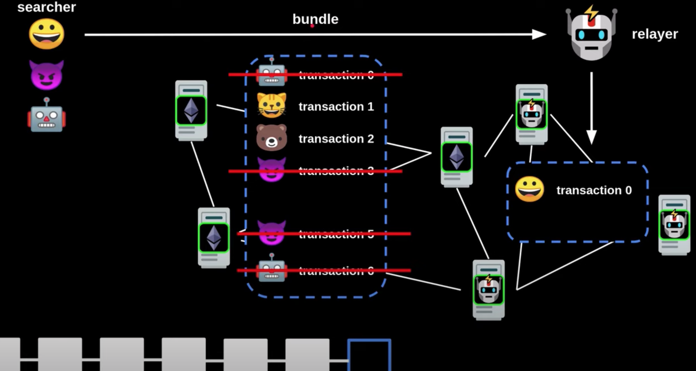

# Flashbots

Advantages: can't be sandwiched attacked or front/back run. You are going into a private mempool that will never be a "pending" transaction. Must pay gas to be in this pool instead of normal mempool.

Good article on front running [here](https://medium.com/degate/an-analysis-of-ethereum-front-running-and-its-defense-solutions-34ef81ba8456)



**<u>Example code on a flashbot bundle from this: [repo](https://github.com/t4sk/hello-flashbot)</u>**

```typescript
//basic imports for flashbots bundle
import { providers, Wallet } from "ethers";
import {
  FlashbotsBundleProvider,
  FlashbotsBundleResolution,
} from "@flashbots/ethers-provider-bundle";

const GWEI = 10n ** 9n;
const ETHER = 10n ** 18n;

//running on goerli testnet
const CHAIN_ID = 5; // goerli
const FLASHBOTS_ENDPOINT = "https://relay-goerli.flashbots.net";

//specified in .env file
const provider = new providers.JsonRpcProvider({
  // @ts-ignore
  url: process.env.ETH_RPC_URL,
});

// @ts-ignore
const wallet = new Wallet(process.env.PRIVATE_KEY, provider);

async function main() {
  const signer = new Wallet(
  //for signing tx
    "0x2000000000000000000000000000000000000000000000000000000000000000"
  );
  //   const signer = Wallet.createRandom();
  const flashbot = await FlashbotsBundleProvider.create(
    provider,
    signer,
    FLASHBOTS_ENDPOINT
  );
  
  //send a tx to the flashbots on every block until it is mined
  provider.on("block", async (block) => {
    console.log(`block: ${block}`);

    const signedTx = await flashbot.signBundle([
      {
        signer: wallet,
        transaction: {
          chainId: CHAIN_ID,
          // EIP 1559 transaction
          type: 2,
          value: 0,
          data: "0x",
          maxFeePerGas: GWEI * 3n,
          maxPriorityFeePerGas: GWEI * 2n,
          gasLimit: 1000000,
          to: "0x26C4ca34f722BD8fD23D58f34576d8718c883A80",
        },
      },
    ]);

    const targetBlock = block + 1;
    
    //simulate that it will work before actually going to real flashbot
    const sim = await flashbot.simulate(signedTx, targetBlock);

    if ("error" in sim) {
      console.log(`simulation error: ${sim.error.message}`);
    } else {
      // console.log(`simulation success: ${JSON.stringify(sim, null, 2)}`);
      console.log(`simulation success`);
    }

		//once simulation is successful, send the raw bundle
    const res = await flashbot.sendRawBundle(signedTx, targetBlock);
    if ("error" in res) {
      throw new Error(res.error.message);
    }

    const bundleResolution = await res.wait();
    if (bundleResolution === FlashbotsBundleResolution.BundleIncluded) {
      console.log(`Congrats, included in ${targetBlock}`);
      console.log(JSON.stringify(sim, null, 2));
      process.exit(0);
    } else if (
      bundleResolution === FlashbotsBundleResolution.BlockPassedWithoutInclusion
    ) {
      console.log(`Not included in ${targetBlock}`);
    } else if (
      bundleResolution === FlashbotsBundleResolution.AccountNonceTooHigh
    ) {
      console.log("Nonce too high, bailing");
      process.exit(1);
    }
  });
}

main();
```

