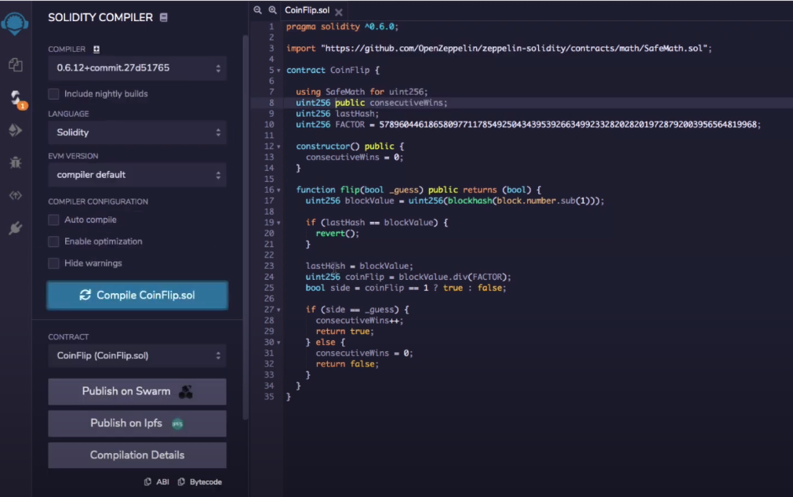
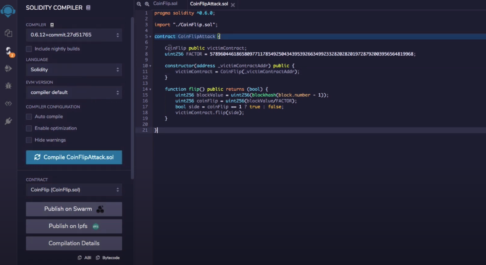
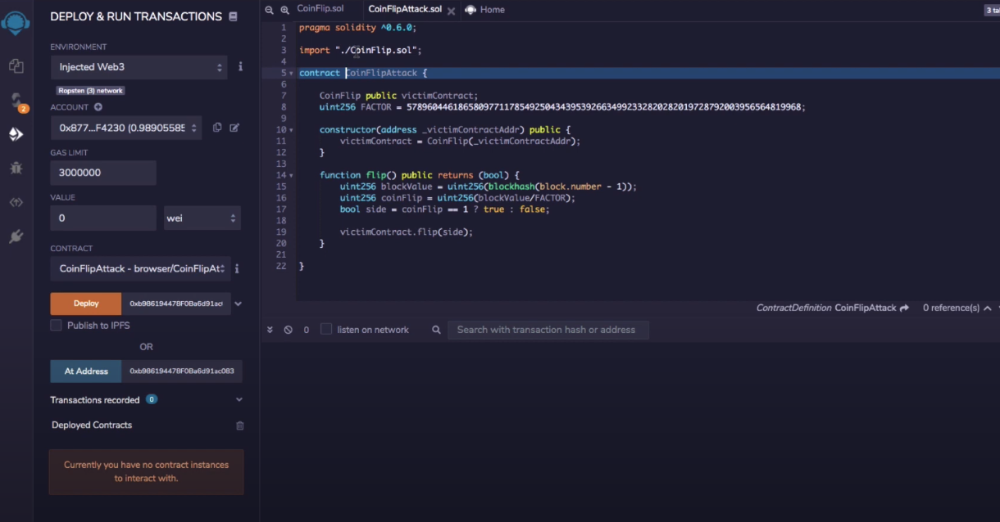
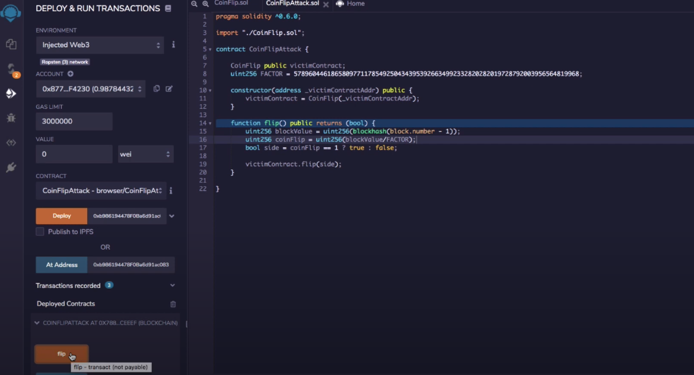

# Mimic'ing an Existing Contract's Algorithm

If a smart contract is trying to computer randomness  using its own algorithm, we can copy and paste it in remix, compile a new "attacking" contract and then execute that against the real one. 

**<u>Example</u>**:

Victim Contract (you create for the purposes of your own attacking contract compiling): Copy and paste into Remix, keep same name and compile

Attacking contract (you create and own): Compile and make sure to have constructor set to the victim contract you just made

Deploy and Run: Change Environment to InjectedWeb3, select your attack contract, and deploy it at the address of the contract you're attacking (it'll send that address to the constructor)

Now we can interact with the contract by clicking the function that we made and it'll interact with the real contract we're attacking

