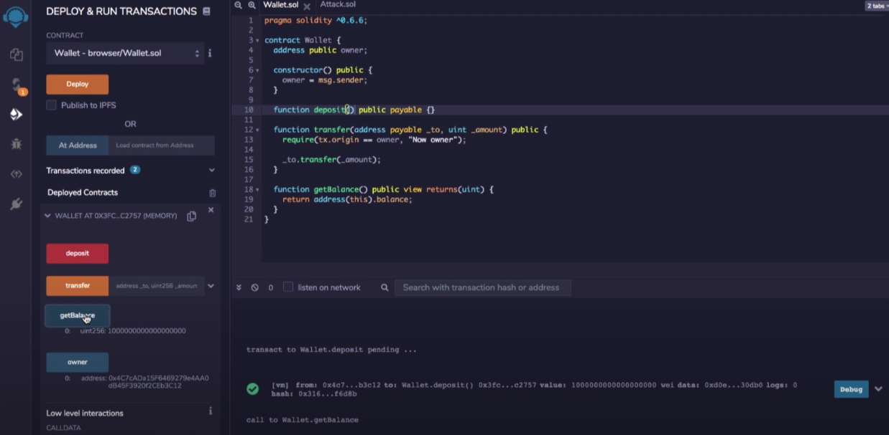
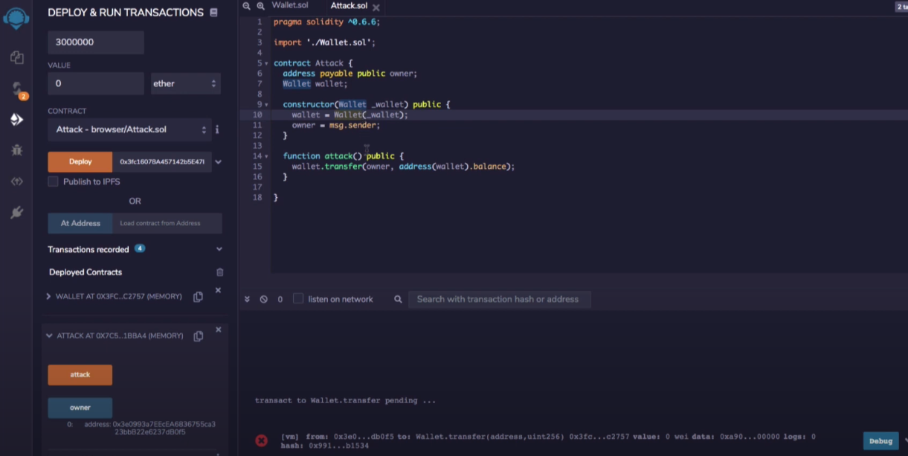

# Tx.Origin 

Never ever use `tx.origin` to verifiy msg.sender

Tx.origin is the <u>sender</u> of the transaction (full call chain), whereas msg.sender is the <u>immediate</u> account/address that called the function.

EOA (externally owned account) is the only type of account that can initiate a transaction and own a private key.

A smart contract can never start a transaction. It can only call functions. 

<u>Phishing attack example:</u>

Note the line in transfer that says tx.origin == owner. That means we just need to get the owner of contract to initiate the transacation. Which can be as easy as making them click a link like so:

