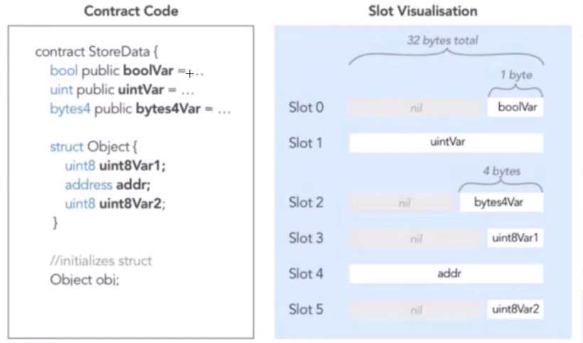
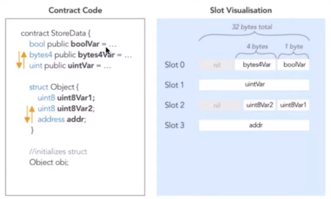
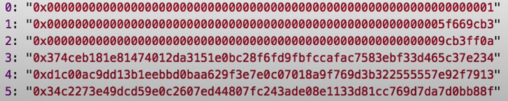

# Storage Concepts

NOTHING ON THE ETHEREUM BLOCKCHAIN IS PRIVATE. Storage is all readable. 

The `private` keyword just means that variable is only accessible from within the contract.

Data is stored in index based slots. From right to left.

Constants are not stored in storage.

Each slot in storatge contains 256 bits

<u>Ineffecient way to store:</u>




<u>Improved Way:</u>




Example Code:

```solidity
// SPDX-License-Identifier: MIT
pragma solidity ^0.6.0;

contract Privacy {

  bool public locked = true;
  uint256 public ID = block.timestamp;
  uint8 private flattening = 10;
  uint8 private denomination = 255;
  uint16 private awkwardness = uint16(now);
  bytes32[3] private data;

  constructor(bytes32[3] memory _data) public {
    data = _data;
  }
  
  function unlock(bytes16 _key) public {
    require(_key == bytes16(data[2]));
    locked = false;
  }

  /*
    A bunch of super advanced solidity algorithms...

      ,*'^`*.,*'^`*.,*'^`*.,*'^`*.,*'^`*.,*'^`
      .,*'^`*.,*'^`*.,*'^`*.,*'^`*.,*'^`*.,*'^`*.,
      *.,*'^`*.,*'^`*.,*'^`*.,*'^`*.,*'^`*.,*'^`*.,*'^         ,---/V\
      `*.,*'^`*.,*'^`*.,*'^`*.,*'^`*.,*'^`*.,*'^`*.,*'^`*.    ~|__(o.o)
      ^`*.,*'^`*.,*'^`*.,*'^`*.,*'^`*.,*'^`*.,*'^`*.,*'^`*.,*'  UU  UU
  */
}

```

After querying storage with a loop (see console commands), we get:



We want the last index of the data[] array. 

Slot 0 = locked (bool)

Slot 1 = block.timestamp (uint256)

Slot 2 = Flattening (10) is 0a, Denomination (255) is ff, Awkwardness (uint16) is 9cb3

data[2] = Slot 5, the last slot

We need to convert into byte16 variable and pass into as _key

```solidity
//cast it in solidity
function unlock(bytes32 _slotValue) public {
	bytes16 key = bytes16(_slotValue);
    target.unlock(key);
    }
```

