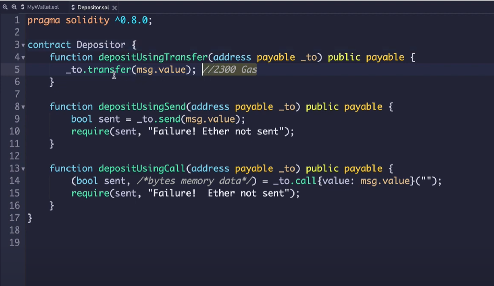

# Sending Money

There are 3 ways to transfer money on Ethereum:

1. Transfer. 2300 gas neededNeeds receiving contract to have receive AND external payable there. Will throw an error.
2. Send. 2300 gas needed. Does not throw error. Returns true or false.
3. Call (this is the most secure way). Can call any other function (using method signatures through encoding). Returns true/false and data. Can also specify gas via gas like so: `call{gas: 1000, value: msg.value}("");`
   1. You must specify a fixed gas stipend to prevent DoS attacks (like `assert(false);` as an attacking contract's fallback function)

